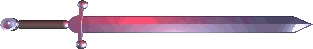

  
   
  <h1><samp>hi, i'm Jesse</samp> </h1>
  
<samp>software engineer · south carolina</samp>

   
  
<samp>PHP · TypeScript · Rust · Java · Lua · Nix Vue · Laravel · Docker · Wayland · Linux</samp>

  

    
    &nbsp;
    
    &nbsp;
    
  

  
<samp>building things · configuring linux · collecting pixels</samp>

  
<samp><a href="https://github.com/malinoskj2?tab=repositories">projects ↗</a>&nbsp;&nbsp;&nbsp;&nbsp;<a href="https://malinoskj2.dev">contact ↗</a></samp>

   

