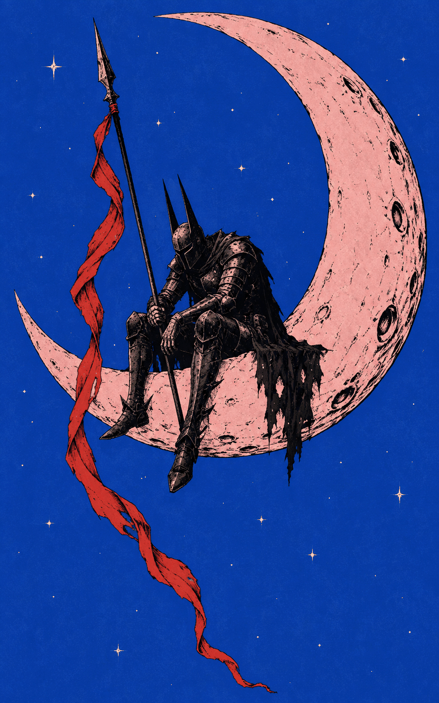
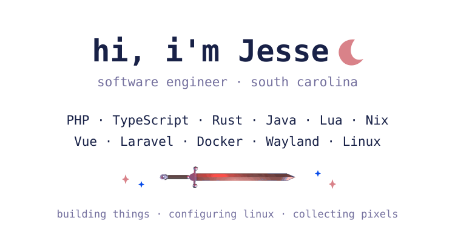

  
  <picture>
    <source media="(prefers-color-scheme: dark)" srcset="assets/profile-framed-mocha.svg">
    <source media="(prefers-color-scheme: light)" srcset="assets/profile-framed-latte.svg">
    
  </picture>
  

    <samp><a href="https://github.com/malinoskj2?tab=repositories">projects ↗</a>&nbsp;&nbsp;&nbsp;&nbsp;<a href="https://malinoskj2.dev">contact ↗</a></samp>
  

   

