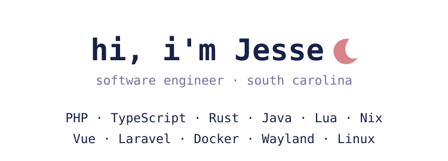

<!-- Generated by scripts/generate-profile.py. Edit profile.json for profile text and links. -->

  
  <picture>
    <source media="(prefers-color-scheme: dark)" srcset="assets/profile-dark.svg">
    <source media="(prefers-color-scheme: light)" srcset="assets/profile-light.svg">
    
  </picture>
   
  
  &nbsp;
  
  &nbsp;
  
   
  <picture>
    <source media="(prefers-color-scheme: dark)" srcset="assets/profile-footer-dark.svg">
    <source media="(prefers-color-scheme: light)" srcset="assets/profile-footer-light.svg">
    
  </picture>
   
  <samp><a href="https://github.com/malinoskj2?tab=repositories">projects ↗</a>&nbsp;&nbsp;&nbsp;&nbsp;<a href="https://malinoskj2.dev">contact ↗</a></samp>
   

